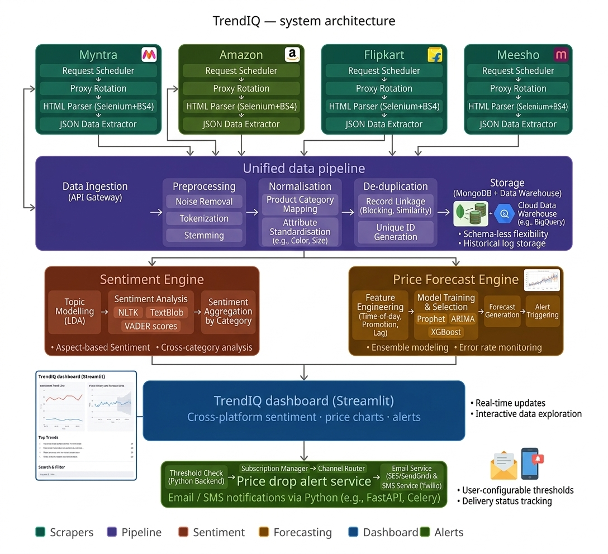

# 🚀 Advanced TrendIQ: Real-Time Retail Intelligence Scraper

<p align="center">
  
</p>

<p align="center">
  
  
  
  
  
</p>

---

## 📌 Overview

**Advanced TrendIQ** is a **multi-platform retail intelligence system** that extracts, analyzes, and forecasts e-commerce data to enable smarter purchasing decisions.

It goes beyond scraping by integrating:
- 📊 **Sentiment Analysis** → Customer Satisfaction Index  
- 📉 **Price Forecasting** → Best time to buy  
- 🔔 **Real-Time Alerts** → Price drop notifications  
- 📱 **Android App** → Built with Jetpack Compose  

---

## ✨ Key Features

- 🔎 Multi-platform scraping (**Myntra, Amazon, Flipkart, Meesho**)  
- 💬 Review sentiment classification (positive / neutral / negative)  
- 📈 Price trend analysis & forecasting  
- 📊 Interactive dashboard (Streamlit)  
- 🔔 Automated price drop alerts (Email/SMS)  
- ☁️ Scalable MongoDB data storage  

---

## 🏗️ System Architecture


### 🔍 Architecture Breakdown

#### 🟢 Distributed Scrapers
- Platform-specific scraping modules  
- Tech Stack:
  - **Selenium** → dynamic content rendering  
  - **BeautifulSoup (BS4)** → HTML parsing  

#### 🟣 Data Pipeline
- Data cleaning, normalization & deduplication  
- Stored in **MongoDB** for historical analysis  

#### 🟤 Analysis Engines

**1. Sentiment Engine**
- Tools: **NLTK, TextBlob, VADER**
- Output: polarity score + classification  

**2. Price Forecast Engine**
- Model: **Prophet (time-series forecasting)**
- Output: predicted price trends  

#### 🔵 Dashboard Layer
- Built using **Streamlit**
- Displays:
  - Product comparison  
  - Sentiment insights  
  - Price trends  

#### 🟢 Alert Service
- Detects target price thresholds  
- Sends:
  - 📧 Email alerts  
  - 📱 SMS notifications  

---

## ⚙️ Local Setup Guide

### 1️⃣ Clone Repository
```bash
git clone https://github.com/AagmanTiwari/TrendIQ.git
cd TrendIQ
```

### 2️⃣ Create Environment
```bash
conda create -p ./env python=3.10 -y
conda activate ./env
```

### 3️⃣ Install Requirements
```bash
pip install -r requirements.txt
```

### 4️⃣ Configure Environment
Create a `.env` file and add:
```
MONGO_URI=your_mongodb_connection_string
```

### 5️⃣ Run Application
```bash
streamlit run app.py
```

### 6️⃣ Open in Browser
```
http://localhost:8501
```

---

## 📦 Tech Stack

| Category              | Technologies Used |
|---------------------|-----------------|
| Frontend Dashboard  | Streamlit |
| Web Scraping        | Selenium, BeautifulSoup |
| NLP & Sentiment     | NLTK, TextBlob, VADER |
| ML / Forecasting    | Prophet, Scikit-learn |
| Database            | MongoDB |
| Backend Utilities   | database-connect |
| Mobile App          | Jetpack Compose |

---

## 🔧 ChromeDriver Optimization

Instead of using `chromedriver.exe`, this project uses the **ChromeDriver PyPI binary**:

### ✅ Benefits:
- Cross-platform compatibility  
- No manual driver setup  
- Automatic version management  

---

## 🗄️ Database Integration

- **MongoDB** is used for scalable storage  
- Managed via **database-connect** package  
- Stores:
  - Product data  
  - Reviews  
  - Price history  

---

## 📱 Future Enhancements

- 🔄 Real-time scraping pipelines (Kafka / Airflow)  
- 🤖 Advanced ML models for recommendation  
- 🌐 Deployment on cloud (AWS / GCP)  
- 📊 Power BI / Tableau integration  
- 🧠 Deep learning sentiment models  

---

## 🤝 Contributing

Contributions are welcome!

Steps:
1. Fork the repository  
2. Create a feature branch  
3. Commit your changes  
4. Submit a pull request  

---

## ⭐ Why This Project Stands Out

- Combines **Web Scraping + NLP + Time-Series ML**
- Real-world use case: **Smart shopping decisions**
- End-to-end system: **Data → Insight → Action**
- Includes **Web + Mobile integration**

---

## 📬 Contact

For queries or collaboration:
- Open an issue on GitHub  

---

## 🎯 Final Note

> Turning raw e-commerce data into actionable intelligence.

**Happy Scraping! 🕵️‍♂️🚀**